<h1 align="center">Awesome Dynamic Neural Networks Papers for Computer Vision and Sensor Fusion Applications</h1>
<p align="center">
  <a href="https://awesome.re">
    
  </a>
  <a href="https://doi.org/10.1016/j.imavis.2026.105980">
    
  </a>
  <a href="https://arxiv.org/pdf/2501.07451">
    
  </a>
</p>

A curated collection of Dynamic Neural Networks (DyNN) papers in the context of Computer Vision and Sensor Fusion Applications. This repository gathers the most relevant research that explores adaptive, dynamic, and efficient neural networks in a variety of settings including token skimming, early exits, and dynamic routing. A section dedicated to Sensor Fusion is also present.

The survey related to the presented list of papers has been published in Image and Vision Computing journal and can be found here: [A Survey on Dynamic Neural Networks: from
Computer Vision to Multi-modal Sensor Fusion](https://doi.org/10.1016/j.imavis.2026.105980).

## Citation

If you find this repository useful in your research, please consider citing it:

```bibtex
@article{MONTELLO2026105980,
    title = {A survey on dynamic neural networks: From computer vision to multi-modal sensor fusion},
    journal = {Image and Vision Computing},
    volume = {170},
    pages = {105980},
    year = {2026},
    issn = {0262-8856},
    doi = {https://doi.org/10.1016/j.imavis.2026.105980},
    url = {https://www.sciencedirect.com/science/article/pii/S0262885626000879},
    author = {Fabio Montello and Ronja Güldenring and Simone Scardapane and Lazaros Nalpantidis}
}
```

## Table of Contents

- [Early Exit](#early-exit)
- [Dynamic Routing](#dynamic-routing)
- [Token Skimming](#token-skimming)
- [Sensor Fusion](#sensor-fusion)


## Papers per Year

```mermaid
%%{init: {
  'themeVariables': {
    'xyChart': {
      'plotColorPalette': '#b6d9a3, #a6c1eb, #ffd2a2, #fda29b'
    }
  }
}}%%
xychart-beta
    title "Paper count per year, by category"
    x-axis [2016, 2017, 2018, 2019, 2020, 2021, 2022, 2023, 2024, 2025, 2026]
    y-axis "Papers" 0 --> 35
    bar "Early Exit" [3, 7, 10, 11, 18, 20, 22, 29, 30, 32, 12]
    bar "Dynamic Routing" [1, 6, 9, 4, 9, 10, 14, 19, 18, 25, 11]
    bar "Token Skimming" [0, 1, 2, 1, 0, 3, 9, 15, 11, 18, 7]
    bar "Sensor Fusion" [0, 1, 2, 1, 0, 0, 3, 4, 1, 7, 3]
```



## Early Exit

**Type column legend**: *Architecture* Structural network designs. *Method* Algorithmic innovations. *Application* Domain-specific implementations. 

### 2023 - Present

|   Publication Year | Title                                                                                                                                                                                                                         | Main contribution                                                        | Type    | Code          |
|-------------------:|:------------------------------------------------------------------------------------------------------------------------------------------------------------------------------------------------------------------------------|:-------------------------------------------------------------------------|:--------------|:--------------|
|               2026 | [EnViT: Enhancing the Performance of Early-Exit Vision Transformers via Exit-Aware Structured Dropout-Enabled Self-Distillation](https://ojs.aaai.org/index.php/AAAI/article/view/39225)                                     | Exit-aware structured-dropout self-distillation across virtual sub-models | Method       |  |
|               2025 | [CalexNet: Soft Cascade-Aligned Training and Calibration for Lightweight Early-Exit Branches](https://arxiv.org/abs/2509.08318)                                                                                               | Cascade-aligned training and calibration for lightweight exit branches   | Method       |  |
|               2025 | [Rethinking Calibration for Early-Exit Neural Networks](https://arxiv.org/abs/2508.21495)                                                                                                                                     | Proposes AUROC-based Early-Exit Failure Prediction as a better proxy than calibration | Method | |
|               2025 | [CEED-VLA: Consistency Vision-Language-Action Model with Early-Exit Decoding](https://arxiv.org/abs/2506.13725)                                                                                                               | Consistency distillation with early-exit Jacobi decoding for robot VLA models | Application | [:octocat:](https://github.com/OpenHelix-Team/CEED-VLA) |
|               2025 | [SAC-ViT: Semantic-Aware Clustering Vision Transformer with Early Exit](https://arxiv.org/abs/2503.00060)                                                                                                                     | Two-stage coarse-to-fine ViT clustering semantically salient tokens with early exit | Architecture | |
|               2025 | [CHASE: Channel-Wise and Spatial Attention for Early Exiting in Image Classification](https://ieeexplore.ieee.org/abstract/document/10888714)                                                                                 | Self-attention to improve feature representation and aggregation         | Architecture |  |
|               2025 | [BEEM: Boosting Performance of Early Exit DNNs using Multi-Exit Classifiers as Experts](http://arxiv.org/abs/2502.00745)                                                                                                      | Reuse of previous exits responses for exit confidence                    | Method       |  |
|               2025 | [You Only Look Once at Anytime (AnytimeYOLO): Analysis and Optimization of Early-Exits for Object-Detection](http://arxiv.org/abs/2503.17497)                                                                                 | Early exit into YOLO architecture                                        | Application  |  |                                               |
|               2024 | [Performance Control in Early Exiting to Deploy Large Models at the Same Cost of Smaller Ones](https://arxiv.org/abs/2412.19325)                                                                                              | Statistical performance-control procedure addressing exit overconfidence/calibration | Method | |
|               2024 | [DeeR-VLA: Dynamic Inference of Multimodal Large Language Models for Efficient Robot Execution](https://arxiv.org/pdf/2411.02359)                                                                                             | Robotic Vision-Language-Action Model with situation-based early exits    | Application  | [:octocat:](https://github.com/yueyang130/DeeR-VLA) |
|               2024 | [A multi-level collaborative self-distillation learning for improving adaptive inference efficiency](https://link.springer.com/10.1007/s40747-024-01572-3)                                                                    | Self distillation with a dynamic generation of the importance weights    | Method       | |
|               2024 | [AdaDet: An Adaptive Object Detection System Based on Early-Exit Neural Networks](https://ieeexplore.ieee.org/document/10121781)                                                                                              | Early Exits for object detection                                         | Application  | |
|               2024 | [EERO: Early Exit with Reject Option for Efficient Classification with limited budget](http://arxiv.org/abs/2402.03779)                                                                                                       | The exiting is formalized as a classification with a reject option       | Method       | |
|               2024 | [Jointly-Learned Exit and Inference for a Dynamic Neural Network : JEI-DNN](http://arxiv.org/abs/2310.09163)                                                                                                                  | Presents a loss for both accuracy and inference cost                     | Method       | [:octocat:](https://github.com/networkslab/dynn) |
|               2024 | [Predicting Probabilities of Error to Combine Quantization and Early Exiting: QuEE](http://arxiv.org/abs/2406.14404)                                                                                                          | Combines quantization and early exit dynamic network                     | Method       | |
|               2024 | [Fixing Overconfidence in Dynamic Neural Networks](https://ieeexplore.ieee.org/document/10484487)                                                                                                                             | Bayesian method to highlight out of distribution samples                 | Method       | [:octocat:](https://github.com/AaltoML/calibrated-dnn) |
|               2024 | [Multiple-Exit Tuning: Towards Inference-Efficient Adaptation for Vision Transformer](http://arxiv.org/abs/2409.13999)                                                                                                        | Introduce an adapter for representations in a shared exit space          | Method       | |
|               2024 | [To Exit or Not to Exit: Cost-Effective Early-Exit Architecture Based on Markov Decision Process](https://www.mdpi.com/2227-7390/12/14/2263)                                                                                  | Method based on the Markov decision process  for the early-exit decision | Method       | |
|               2024 | [Class Based Thresholding in Early Exit Semantic Segmentation Networks](https://ieeexplore.ieee.org/document/10494595/?arnumber=10494595)                                                                                     | Early Exits with threshold tailored to the class                         | Application  | |
|               2024 | [CAPEEN: Image Captioning with Early Exits and Knowledge Distillation](https://arxiv.org/abs/2410.04433)                                                                                                                                                   | ViT with Early Exits for image captioning                                | Application  | [:octocat:](https://github.com/Div290/CapEEN) |
|               2023 | [FIANCEE: Faster Inference of Adversarial Networks via Conditional Early Exits](https://ieeexplore.ieee.org/document/10203139/)                                                                                               | Early Exits applied to Generative Adversarial Networks                   | Application  | |
|               2023 | [Dynamic Perceiver for Efficient Visual Recognition](https://ieeexplore.ieee.org/document/10377175/?arnumber=10377175)                                                                                                        | Decouples the features extraction and the early classification           | Architecture | [:octocat:](https://github.com/LeapLabTHU/Dynamic_Perceiver) |
|               2023 | [Predictive exit: prediction of fine-grained early exits for computation-and energy-efficient inference](https://doi.org/10.1609/aaai.v37i7.26042)                                                                            | learned component to decide where to place the classifiers               | Method       | |
|               2023 | [SEENN: Towards Temporal Spiking Early-Exit Neural Networks](http://arxiv.org/abs/2304.01230)                                                                                                                                 | Early exit architecture applies to a Spiking Neural Network              | Application  | |
|               2023 | [Self-supervised efficient sample weighting for multi-exit networks](https://www.sciencedirect.com/science/article/pii/S0950705123007530)                                                                                     | Balance the loss contribution by weight prediction                       | Method       | |
|               2023 | [Zero time waste in pre-trained early exit neural networks](https://www.sciencedirect.com/science/article/pii/S0893608023005555)                                                                                              | Applies Zero Time Waste to diffusion models                              | Application  | [:octocat:](https://github.com/gmum/Zero-Time-Waste) |
|               2023 | [Dynamic Token Pruning in Plain Vision Transformers for Semantic Segmentation](https://ieeexplore.ieee.org/document/10378640/)                                                                                                | Token Early Exit for semantic segmentation                               | Architecture | [:octocat:](https://github.com/zbwxp/Dynamic-Token-Pruning) |
|               2023 | [Window-Based Early-Exit Cascades for Uncertainty Estimation: When Deep Ensembles are More Efficient than Single Models](https://ieeexplore.ieee.org/document/10377106/)                                                      | Study of uncertainty estimation when it comes to Early Exit              | Method       | [:octocat:](https://github.com/Guoxoug/window-early-exit) |
|               2023 | [LGViT: Dynamic Early Exiting for Accelerating Vision Transformer](http://arxiv.org/abs/2308.00255)                                                                                                                           | Self-distillation to train Early Exit ViT models                         | Method       | [:octocat:](https://github.com/falcon-xu/LGViT) |
|               2023 | [Adaptive Computation with Elastic Input Sequence](http://arxiv.org/abs/2301.13195)                                                                                                                                           | ViT  which has also the ability to read and store tokens                 | Architecture | |

<details>
<summary>2020 - 2022</summary>

|   Publication Year | Title                                                                                                                                                                                                                         | Main contribution                                                        | Type    | Code          |
|-------------------:|:------------------------------------------------------------------------------------------------------------------------------------------------------------------------------------------------------------------------------|:-------------------------------------------------------------------------|:--------------|:--------------|
|               2022 | [Single-layer vision transformers for more accurate early exits with less overhead](https://www.sciencedirect.com/science/article/pii/S0893608022002532)                                                                      | Early exitsaudiovisual crowd counting with Transformer                   | Application  | |
|               2022 | [Self-Distillation: Towards Efficient and Compact Neural Networks](https://ieeexplore.ieee.org/document/9381661/?arnumber=9381661)                                                                                            | Experiments with various self-distillation techniques                    | Method       | |
|               2022 | [Boosted Dynamic Neural Networks](http://arxiv.org/abs/2211.16726)                                                                                                                                                            | Proposes a solution to the train-test mismatch problem                   | Method       | [:octocat:](https://github.com/SHI-Labs/Boosted-Dynamic-Networks) |
|               2022 | [Meta-GF: Training Dynamic-Depth Neural Networks Harmoniously](https://link.springer.com/10.1007/978-3-031-20083-0_41)                                                                                                        | Weighted policy to alleviate gradient conflict problems                  | Method       | [:octocat:](https://github.com/SYVAE/MetaGF) |
|               2022 | [Temporal Early Exits for Efficient Video Object Detection](https://papers.ssrn.com/abstract=4015043)                                                                                                                         | Temporal early exits for video object detection                          | Application  | |
|               2022 | [A Probabilistic Re-Intepretation of Confidence Scores in Multi-Exit Models](https://www.mdpi.com/1099-4300/24/1/1)                                                                                                           | Train by weighting the prediction with a trained confidence score        | Method       | |
|               2022 | [Multi-Exit Semantic Segmentation Networks](https://link.springer.com/10.1007/978-3-031-19803-8_20)                                                                                                                           | Framework for early exit semantic segmentation                           | Application  | |
|               2022 | [Learning to Weight Samples for Dynamic Early-Exiting Networks](https://arxiv.org/abs/2209.08310)                                                                                                                             | The loss is provided by a weighting network                              | Method       | [:octocat:](https://github.com/LeapLabTHU/L2W-DEN) |
|               2021 | [Zero Time Waste: Recycling Predictions in Early Exit Neural Networks](https://proceedings.neurips.cc/paper/2021/hash/149ef6419512be56a93169cd5e6fa8fd-Abstract.html)                                                         | Reuse the output of internal classifiers as inductive prediction         | Method       | |
|               2021 | [Not All Images are Worth 16x16 Words: Dynamic Transformers for Efficient Image Recognition](https://proceedings.neurips.cc/paper/2021/hash/64517d8435994992e682b3e4aa0a0661-Abstract.html)                                   | Image elaboration at different scales with early exits                   | Architecture | [:octocat:](https://github.com/blackfeather-wang/Dynamic-Vision-Transformer-MindSpore) |
|               2021 | [Harmonized Dense Knowledge Distillation Training for Multi-Exit Architecture](https://ojs.aaai.org/index.php/AAAI/article/view/17225)                                                                                       | Dense knowledge distillation for each exit from all the later exits       | Method       | |
|               2021 | [Empowering Adaptive Early-Exit Inference with Latency Awareness](https://ojs.aaai.org/index.php/AAAI/article/view/17181)                                                                                                     | Threshold determination as non-convex problem                            | Method       | |
|               2021 | [Branchy-GNN: A Device-Edge Co-Inference Framework for Efficient Point Cloud Processing](https://ieeexplore.ieee.org/document/9414831/?arnumber=9414831)                                                                      | Early exits fraph neural network for point cloud                         | Application  | [:octocat:](https://github.com/shaojiawei07/Branchy-GNN) |
|               2021 | [Adaptive Inference for Face Recognition leveraging Deep Metric Learning-enabled Early Exits](https://ieeexplore.ieee.org/document/9616231)                                                                                   | Applies BoF early exits to face recognition                              | Application  | |
|               2021 | [Anytime Dense Prediction with Confidence Adaptivity](https://arxiv.org/abs/2104.00749v2)                                                                                                                                     | Early Exits for semantic segmentation                                    | Application  | [:octocat:](https://github.com/liuzhuang13/anytime) |
|               2021 | [Dynamic Early Exit Scheduling for Deep Neural Network Inference through Contextual Bandits](https://dl.acm.org/doi/10.1145/3459637.3482335)                                                                                  | Early exits for video analytics                                          | Application  | |
|               2021 | [FrameExit: Conditional Early Exiting for Efficient Video Recognition](https://openaccess.thecvf.com/content/CVPR2021/html/Ghodrati_FrameExit_Conditional_Early_Exiting_for_Efficient_Video_Recognition_CVPR_2021_paper.html) | Offline frame sampling strategy with early exits                         | Application  | [:octocat:](https://github.com/Qualcomm-AI-research/FrameExit) |
|               2021 | [Improving the Accuracy of Early Exits in Multi-Exit Architecture via Curriculum Learning](http://arxiv.org/abs/2104.10461)                                                                                                  | Use of curriculum learning to train                                       | Method       | |
|               2020 | [Edge AI: On-Demand Accelerating Deep Neural Network Inference via Edge Computing](https://ieeexplore.ieee.org/document/8876870/?arnumber=8876870)                                                                            | Split computations between on-device and cloud                           | Application  | |
|               2020 | [Learning to Stop While Learning to Predict](http://arxiv.org/abs/2006.05082)                                                                                                                                                 | Exit problem seen as variational Bayes                                   | Method       | [:octocat:](https://github.com/xinshi-chen/l2stop) |
|               2020 | [FlexDNN: Input-Adaptive On-Device Deep Learning for Efficient Mobile Vision](https://ieeexplore.ieee.org/document/9355785/?arnumber=9355785)                                                                                 | Applies early exits to video analysis                                    | Application  | |
|               2020 | [SPINN: synergistic progressive inference of neural networks over device and cloud](https://dl.acm.org/doi/10.1145/3372224.3419194)                                                                                           | Split computations between on-device and cloud                           | Application  | |
|               2020 | [HAPI: Hardware-Aware Progressive Inference](https://ieeexplore.ieee.org/document/9256461/?arnumber=9256461)                                                                                                                  | First to investigate optimal exit positioning                            | Method       | |
|               2020 | [Efficient adaptive inference for deep convolutional neural networks using hierarchical early exits](https://linkinghub.elsevier.com/retrieve/pii/S0031320320301497)                                                          | Bag-of-features + single classifier                                      | Method       | |
|               2020 | [Differentiable Branching In Deep Networks for Fast Inference](https://ieeexplore.ieee.org/document/9054209/?arnumber=9054209)                                                                                                | Weighting method to estimate exit confidence                             | Method       | |
|               2020 | [Early Exit or Not: Resource-Efficient Blind Quality Enhancement for Compressed Images](https://link.springer.com/10.1007/978-3-030-58517-4_17)                                                                               | Application on compressed image enanchement                              | Application  | [:octocat:](https://github.com/ryanxingql/rbqe) |
|               2020 | [Resolution Adaptive Networks for Efficient Inference](https://ieeexplore.ieee.org/document/9157556/)                                                                                                                         | Processes images at a coarser scale first                                | Architecture | [:octocat:](https://github.com/yangle15/RANet-pytorch) |

</details>

<details>
<summary>2019 and Earlier</summary>

|   Publication Year | Title                                                                                                                                                                                                                         | Main contribution                                                        | Type    | Code          |
|-------------------:|:------------------------------------------------------------------------------------------------------------------------------------------------------------------------------------------------------------------------------|:-------------------------------------------------------------------------|:--------------|:--------------|
|               2019 | [Be Your Own Teacher: Improve the Performance of Convolutional Neural Networks via Self Distillation](https://ieeexplore.ieee.org/document/9008829/)                                                                          | Improves self-distillation loss                                          | Method       | [:octocat:](https://github.com/luanyunteng/pytorch-be-your-own-teacher) |
|               2019 | [SEE: Scheduling Early Exit for Mobile DNN Inference during Service Outage](https://dl.acm.org/doi/10.1145/3345768.3355917)                                                                                                   | Frame dropping according to budget                                       | Application  | |
|               2019 | [DynExit: A Dynamic Early-Exit Strategy for Deep Residual Networks](https://ieeexplore.ieee.org/document/9020551/?arnumber=9020551)                                                                                           | Dynamic loss-weight modification                                         | Method       | [:octocat:](https://github.com/jianqiaomo/mywebpage/issues/8) |
|               2019 | [Distillation-Based Training for Multi-Exit Architecture](https://ieeexplore.ieee.org/document/9009834/)                                                                                                                     | Introduce self-distillation                                               | Method       | |
|               2019 | [Adaptive Inference Using Hierarchical Convolutional Bag-of-Features for Low-Power Embedded Platforms](https://ieeexplore.ieee.org/document/8803283/?arnumber=8803283)                                                        | Bag-of-features + single classifier                                      | Method       | |
|               2019 | [Improved Techniques for Training Adaptive Deep Networks](https://ieeexplore.ieee.org/document/9010043/?arnumber=9010043)                                                                                                     | Rescale gradient magnitude                                               | Method       | [:octocat:](https://github.com/kalviny/IMTA) |
|               2019 | [Shallow-Deep Networks: Understanding and Mitigating Network Overthinking](https://proceedings.mlr.press/v97/kaya19a.html)                                                                                                    | Slight variation wrt BranchyNet                                          | Architecture | [:octocat:](https://github.com/yigitcankaya/Shallow-Deep-Networks) |
|               2018 | [Multi-Scale Dense Networks for Resource Efficient Image Classification](http://arxiv.org/abs/1703.09844)                                                                                                                     | Multi-scale architecture                                                 | Architecture | [:octocat:](https://github.com/gaohuang/MSDNet) |
|               2017 | [Adaptive Neural Networks for Efficient Inference](https://arxiv.org/abs/1702.07811)                                                                                                                                          | Combination with nets ensamble                                           | Architecture | [:octocat:](https://github.com/tolga-b/ann) |
|               2016 | [BranchyNet: Fast inference via early exiting from deep neural networks](https://ieeexplore.ieee.org/abstract/document/7900006)                                                                                               | First end-to-end network                                                 | Architecture | [:octocat:](https://github.com/kunglab/branchynet) |
|               2016 | [Conditional Deep Learning for Energy-Efficient and Enhanced Pattern Recognition](http://ieeexplore.ieee.org/xpl/articleDetails.jsp?arnumber=7459357)                                                                         | Seminal work                                                             | Architecture | |

</details>


## Dynamic Routing

**Type column legend**: *Path* Adaptive routing or processing paths in the network. *Block* Innovations involving layer or block-level adjustments. *MoE* Mixture of Experts. *Application* Domain-specific implementations. 

### 2023 - Present

|   Publication Year | Title                                                                                                                                                                                                                             | Main contribution                                                                                     | Type   | Code          |
|-------:|:----------------------------------------------------------------------------------------------------------------------------------------------------------------------------------------------------------------------------------|:-----------------------------------------------------------------------------------------------------|:----------|:--------------|
|   2026 | [Beyond Routing: Characterising Expert Tuning and Representation in Vision Mixture-of-Experts](https://arxiv.org/abs/2605.20610)                                                                                                  | Characterizes expert specialization and representation beyond the router in vision MoE                | MoE               | |
|   2026 | [Teacher-Guided Routing for Sparse Vision Mixture-of-Experts (TGR-MoE)](https://openaccess.thecvf.com/content/CVPR2026/html/Kada_Teacher-Guided_Routing_for_Sparse_Vision_Mixture-of-Experts_CVPR_2026_paper.html)               | Distills routing supervision from a pretrained dense teacher to stabilize sparse vision MoE training (CVPR 2026) | MoE | |
|   2026 | [DySL-VLA: Efficient Vision-Language-Action Model Inference via Dynamic-Static Layer-Skipping for Robot Manipulation](https://arxiv.org/abs/2602.22896)                                                                          | Statically keeps informative layers and dynamically skips others via action-importance-guided routing (DAC 2026) | Block | [:octocat:](https://github.com/PKU-SEC-Lab/DYSL_VLA) |
|   2026 | [MoLe-VLA: Dynamic Layer-skipping Vision Language Action Model via Mixture-of-Layers](https://ojs.aaai.org/index.php/AAAI/article/view/38945)                                                                                    | Spatio-Temporal Aware Router treats each LLM layer as an expert to dynamically activate/skip layers for robot manipulation (AAAI 2026) | Block | |
|   2025 | [Skip-It? Theoretical Conditions for Layer Skipping in Vision-Language Models](https://arxiv.org/abs/2509.25584)                                                                                                                  | Redundancy metrics that provably bound safe layer skipping in VLMs                                    | Block             | |
|   2025 | [MoSE: Skill-by-Skill Mixture-of-Experts Learning for Embodied Autonomous Machines](https://arxiv.org/abs/2507.07818)                                                                                                             | Skill-specialized MoE for embodied autonomous driving/decision-making                                  | MoE               | |
|   2025 | [Learning to Skip the Middle Layers of Transformers](https://arxiv.org/abs/2506.21103)                                                                                                                                            | Dynamically skips redundant middle transformer blocks per token via a learned router                   | Block             | |
|   2025 | [PSReg: Prior-guided Sparse Mixture of Experts for Point Cloud Registration](https://ojs.aaai.org/index.php/AAAI/article/view/32395)                                                                                              | MoE applied to Point Cloud registration task                                                |  Application       |  |
|   2025 | [HotMoE: Exploring Sparse Mixture-of-Experts for Hyperspectral Object Tracking](https://ieeexplore.ieee.org/abstract/document/10855488)                                                                                           | MoE strategy for reducing hyperspectral images computational complexity                     |  Application       |  |
|   2025 | [Towards Accurate and Efficient 3D Object Detection for Autonomous Driving: A Mixture of Experts Computing System on Edge](http://arxiv.org/abs/2507.04123)                                                                       | Multiscale MoE for low latency and high accuracy in 3D object detection                     |  Application       | [:octocat:](https://github.com/LinshenLiu622/EMC2) |
|   2025 | [DiffCR / DiffRatio-MoD: Layer- and Timestep-Adaptive Differentiable Token Compression Ratios for Efficient Diffusion Transformers](https://openaccess.thecvf.com/content/CVPR2025/html/You_Layer-_and_Timestep-Adaptive_Differentiable_Token_Compression_Ratios_for_Efficient_Diffusion_CVPR_2025_paper.html) | Learns per-layer/per-timestep compression ratios giving Mixture-of-Depths efficient DiTs (CVPR 2025)   | MoE               | |
|   2024 | [ViMoE: An Empirical Study of Designing Vision Mixture-of-Experts](http://arxiv.org/abs/2410.15732)                                                                                                                               | Empirical study on MoE design                                                               |  MoE               | |
|   2024 | [Mixture of Experts in Image Classification: What's the Sweet Spot?](https://arxiv.org/abs/2411.18322)                                                                                                                            | Finds MoE helps small/mid models most; Last-2/Every-2 placement + linear router work best              | MoE               | |
|   2024 | [Mixture of Nested Experts: Adaptive Processing of Visual Tokens](https://proceedings.neurips.cc/paper_files/paper/2024/hash/6b768359d0e8925164f61f381a748441-Abstract-Conference.html)                                           | The model learns to dynamically process less important tokens with a less detailed representation  |  MoE               | |
|   2024 | [MoDE: A Mixture-of-Experts Model with Mutual Distillation among the Experts](https://ojs.aaai.org/index.php/AAAI/article/view/29539)                                                                                             | Distillation among experts to allow each expert to get a better perception                  |  MoE               | |
|   2024 | [DyFADet: Dynamic Feature Aggregation for Temporal Action Detection](https://link.springer.com/10.1007/978-3-031-72952-2_18)                                                                                                      | Adapts kernel weights and receptive field for different frames in Temporal Action Detection |  Application       | [:octocat:](https://github.com/yangle15/DyFADet-pytorch) |
|   2024 | [Routers in Vision Mixture of Experts: An Empirical Study](http://arxiv.org/abs/2401.15969)                                                                                                                                       | Studies different approaches of MoE in the context of ViT                                   |  MoE               | |
|   2024 | [Adaptive Layer Selection for Efficient Vision Transformer Fine-Tuning](http://arxiv.org/abs/2408.08670)                                                                                                                          | Layer skipping in the fine-tuning of ViT                                                    |  Block             | [:octocat:](https://github.com/NVlabs/A-ViT) |
|   2023 | [Robust Mixture-of-Expert Training for Convolutional Neural Networks](https://ieeexplore.ieee.org/document/10377558/)                                                                                                             | Discuss adversarial attacks and robustness in the context of MoE                            |  MoE               | [:octocat:](https://github.com/OPTML-Group/Robust-MoE-CNN) |
|   2023 | [SegBlocks: Block-Based Dynamic Resolution Networks for Real-Time Segmentation](https://ieeexplore.ieee.org/abstract/document/9744000)                                                                                            | Adjusts dynamically the processing resolution of image regions                              |  Path              | [:octocat:](https://github.com/thomasverelst/segblocks-segmentation-pytorch) |
|   2023 | [GradMDM: Adversarial Attack on Dynamic Networks](https://ieeexplore.ieee.org/document/10089510/?arnumber=10089510)                                                                                                               | Studies adversarial attacks on dynamic models                                               |  Application       | [:octocat:](https://github.com/lingengfoo/GradMDM) |
|   2023 | [DPACS: Hardware Accelerated Dynamic Neural Network Pruning through Algorithm-Architecture Co-design](https://dl.acm.org/doi/10.1145/3575693.3575728)                                                                             | Spatial and channel pruning hardware accelerator                                            |  Application       | [:octocat:](https://github.com/CASR-HKU/DPACS) |

<details>
<summary>2020 - 2022</summary>

|   Publication Year | Title                                                                                                                                                                                                                             | Main contribution                                                                                     | Type   | Code          |
|-------:|:----------------------------------------------------------------------------------------------------------------------------------------------------------------------------------------------------------------------------------|:-----------------------------------------------------------------------------------------------------|:----------|:--------------|
|   2022 | [Dynamically Throttleable Neural Networks](https://arxiv.org/abs/2011.02836)                                                                                                                                                      | Self-regulate computations according to performance target and resources available          |  Path              | [:octocat:](https://github.com/liuhengyue/dtnn) |
|   2022 | [M3ViT: Mixture-of-Experts Vision Transformer for Efficient Multi-task Learning with Model-Accelerator Co-design](nan)                                                                                                            | Method to accelerate MoE for multi-task ViT                                                 |  MoE               | [:octocat:](https://github.com/VITA-Group/M3ViT) |
|   2022 | [AdaViT: Adaptive Vision Transformers for Efficient Image Recognition](https://ieeexplore.ieee.org/document/9879366/)                                                                                                             | Block skipping in Transformer                                                               |  Block             | [:octocat:](https://github.com/MengLcool/AdaViT) |
|   2022 | [AdaFocus V2: End-to-End Training of Spatial Dynamic Networks for Video Recognition](https://ieeexplore.ieee.org/document/9879690/)                                                                                               | One stage adaptive patch location for Video Recognition                                     |  Application       | [:octocat:](https://github.com/LeapLabTHU/AdaFocusV2) |
|   2022 | [AdaFocusV3: On Unified Spatial-Temporal Dynamic Video Recognition](https://link.springer.com/10.1007/978-3-031-19772-7_14)                                                                                                       | Adaptive patch location for Video Recognition with conditional exits                        |  Application       | |
|   2021 | [Adaptive Focus for Efficient Video Recognition](https://ieeexplore.ieee.org/document/9711320/)                                                                                                                                   | Adaptive patch location for Video Recognition                                               |  Application       | [:octocat:](https://github.com/blackfeather-wang/AdaFocus) |
|   2021 | [Dynamic Network Quantization for Efficient Video Inference](https://ieeexplore.ieee.org/document/9711308/)                                                                                                                       | Adaptive model precision and frame skipping for Video Recognition                           |  Application       | |
|   2021 | [Scaling Vision with Sparse Mixture of Experts](https://proceedings.neurips.cc/paper_files/paper/2021/hash/48237d9f2dea8c74c2a72126cf63d933-Abstract.html)                                                                        | MoE in the context of ViT                                                                   |  MoE               | [:octocat:](https://github.com/google-research/vmoe) |
|   2021 | [Learning Dynamic Network Using a Reuse Gate Function in Semi-supervised Video Object Segmentation](https://ieeexplore.ieee.org/document/9577443/)                                                                                | Adaptive routing path for Object Detection                                                  |  Application       | [:octocat:](https://github.com/HYOJINPARK/Reuse_VOS) |
|   2021 | [Dynamic Dual Gating Neural Networks](https://ieeexplore.ieee.org/document/9710448/)                                                                                                                                              | Highlight the informative features in both the channel and spatial dimensions               |  Block             | [:octocat:](https://github.com/CAS-CLab/DGNet) |
|   2021 | [DSelect-k: Differentiable Selection in the Mixture of Experts with Applications to Multi-Task Learning](http://arxiv.org/abs/2106.03760)                                                                                         | Address the problem of slow convergence in sparse gates                                     |  MoE               | |
|   2021 | [Processor Architecture Optimization for Spatially Dynamic Neural Networks](https://ieeexplore.ieee.org/abstract/document/9607013)                                                                                                | Investigates hardware constraints in the context of DyNN                                    |  Application       | |
|   2020 | [Deep Mixture of Experts via Shallow Embedding](https://proceedings.mlr.press/v115/wang20d.html)                                                                                                                                  | MoE at the level of convolutional filters, composed on-the-fly                              |  MoE               | |
|   2020 | [Dual Dynamic Inference: Enabling More Efficient, Adaptive, and Controllable Deep Inference](https://ieeexplore.ieee.org/document/9028245/?arnumber=9028245)                                                                      | Layer and channel skipping for IoT applications                                             |  Application       | |
|   2020 | [Dynamic Convolutions: Exploiting Spatial Sparsity for Faster Inference](https://openaccess.thecvf.com/content_CVPR_2020/html/Verelst_Dynamic_Convolutions_Exploiting_Spatial_Sparsity_for_Faster_Inference_CVPR_2020_paper.html) | Spatially execute convolutional filters  only on important image patches                    |  Block             | [:octocat:](https://github.com/thomasverelst/dynconv) |
|   2020 | [Using Mixture of Expert Models to Gain Insights into Semantic Segmentation](https://ieeexplore.ieee.org/document/9151017/)                                                                                                       | MoE for interpretability of  Semantic Segmentaton                                           |  Application       | |
|   2020 | [Learning Dynamic Routing for Semantic Segmentation](https://ieeexplore.ieee.org/document/9156772/)                                                                                                                               | Adapts the scale at which each image gets processed                                         |  Path              | [:octocat:](https://github.com/Megvii-BaseDetection/DynamicRouting) |
|   2020 | [Learning Layer-Skippable Inference Network](https://ieeexplore.ieee.org/document/9180094)                                                                                                                                        | MoE combinate with layer skipping                                                           |  MoE               | |
|   2020 | [Learning to Generate Content-Aware Dynamic Detectors](http://arxiv.org/abs/2012.04265)                                                                                                                                           | Models the relationship between the sample space and the latent routing space               |  Path              | |
|   2020 | [Biased Mixtures of Experts: Enabling Computer Vision Inference Under Data Transfer Limitations](https://ieeexplore.ieee.org/document/9133338/?arnumber=9133338)                                                                  | MoE with inductive prior bias to certain experts                                            |  MoE               | |
|   2020 | [Fractional Skipping: Towards Finer-Grained Dynamic CNN Inference](https://ojs.aaai.org/index.php/AAAI/article/view/6025)                                                                                                         | Layer-wise adaptive quantization and skip                                                   |  Block             | [:octocat:](https://github.com/Torment123/DFS) |

</details>

<details>
<summary>2019 and Earlier</summary>

|   Publication Year | Title                                                                                                                                                                                                                             | Main contribution                                                                                     | Type   | Code          |
|-------:|:----------------------------------------------------------------------------------------------------------------------------------------------------------------------------------------------------------------------------------|:-----------------------------------------------------------------------------------------------------|:----------|:--------------|
|   2019 | [You Look Twice: GaterNet for Dynamic Filter Selection in CNNs](https://ieeexplore.ieee.org/document/8954158/)                                                                                                                    | Global gating module for channel selection                                                  |  Block             | |
|   2019 | [Channel Gating Neural Networks](http://arxiv.org/abs/1805.12549)                                                                                                                                                                 | Learn specialized convolutional kernels as combination of learnt experts                    |  MoE               | |
|   2019 | [Dynamic Channel Pruning: Feature Boosting and Suppression](https://arxiv.org/abs/1810.05331)                                                                                                                                     | Skip negligible input and output channels                                                   |  Block             | [:octocat:](https://github.com/YOUSIKI/PyTorch-FBS) |
|   2018 | [Convolutional Networks with Adaptive Inference Graphs](https://www.ecva.net/papers/eccv_2018/papers_ECCV/papers/Andreas_Veit_Convolutional_Networks_with_ECCV_2018_paper.pdf)                                                    | Network with adaptive inference graphs                                                      |  Path              | [:octocat:](https://github.com/andreasveit/convnet-aig) |
|   2018 | [Dynamic Deep Neural Networks: Optimizing Accuracy-Efficiency Trade-Offs by Selective Execution](https://ojs.aaai.org/index.php/AAAI/article/view/11630)                                                                          | Selective execution with self-defined topolog                                               |  Path              | |
|   2018 | [Routing Networks: Adaptive Selection of Non-linear Functions for Multi-Task Learning](https://arxiv.org/abs/1711.01239)                                                                                                          | Self-organizing network for multimodal learning                                             |  Path              | [:octocat:](https://github.com/cle-ros/RoutingNetworks) |
|   2018 | [HydraNets: Specialized Dynamic Architectures for Efficient Inference](https://ieeexplore.ieee.org/document/8578941/)                                                                                                             | MoE for features of visually similar classes                                                |  MoE               | [:octocat:](https://github.com/cvpaperchallenge/CVPR2018_Survey/issues/481) |
|   2018 | [SkipNet: Learning Dynamic Routing in Convolutional Networks](https://openaccess.thecvf.com/content_ECCV_2018/html/Xin_Wang_SkipNet_Learning_Dynamic_ECCV_2018_paper.html)                                                        | Selectively skip Convolutional blocks based on the previous layer                           |  Block             | [:octocat:](https://github.com/ucbdrive/skipnet) |
|   2018 | [EnergyNet: Energy-Efficient Dynamic Inference](https://openreview.net/forum?id=Syxp2bgKoX)                                                                                                                                       | RNN for skip decision of CNN blocks                                                         |  Block             | |
|   2018 | [BlockDrop: Dynamic Inference Paths in Residual Networks](https://ieeexplore.ieee.org/document/8579017/)                                                                                                                          | RL policy network for residual blocks skipping                                              |  Block             | [:octocat:](https://github.com/Tushar-N/blockdrop) |
|   2017 | [Hard Mixtures of Experts for Large Scale Weakly Supervised Vision](http://ieeexplore.ieee.org/document/8100023/)                                                                                                                 | MoE of pretrained experts                                                                   |  MoE               | |
|   2017 | [Spatially Adaptive Computation Time for Residual Networks](http://ieeexplore.ieee.org/document/8099677/)                                                                                                                         | Dynamically adjusts the number of  layers for certain regions of the image                  |  Block             | [:octocat:](https://github.com/mfigurnov/sact) |
|   2017 | [Adaptive Neural Networks for Efficient Inference](http://arxiv.org/abs/1702.07811)                                                                                                                                               | Ensemble of networks chained in an acyclic computation graph                                |  Path              | [:octocat:](https://github.com/tolga-b/ann) |
|   2017 | [Runtime Neural Pruning](https://papers.nips.cc/paper_files/paper/2017/hash/a51fb975227d6640e4fe47854476d133-Abstract.html)                                                                                                       | Dynamic channel pruning                                                                     |  Block             | |
|   2017 | [Changing Model Behavior at Test-Time Using Reinforcement Learning](https://arxiv.org/abs/1702.07780)                                                                                                                             | Combination of MoE and Early Exits                                                          |  MoE               | |
|   2016 | [Network of Experts for Large-Scale Image Categorization](https://arxiv.org/abs/1604.06119)                                                                                                                                       | Introduces MoE architecture for CNN                                                         |  MoE               | [:octocat:](https://github.com/karim-ahmed/nofe-caffe) |

</details>


## Token skimming

**Type column legend** *Drop* Dynamic token removal or skipping for efficiency. *Merge* Methods for aggregating similar tokens. *Application* Domain-specific implementations. 

### 2023 - Present

|   Publication Year | Title                                                                                                                                                                               | Main contribution                                                                                 | Type   | Code          |
|-------:|:----------------------------------------------------------------------------------------------------------------------------------------------------------------------------------------|:----------------------------------------------------------------------------------------|:----------|:--------------|
|  2026 | [RAPID: Layer-Wise Redundancy-Aware Pruning and Importance-Driven Token Merging for Efficient ViT](https://arxiv.org/abs/2606.08156)                                                   | Depth-aware token reduction: redundancy-similarity pruning in shallow layers, importance-similarity merging in deep layers | Drop | |
|  2026 | [AdaMerge: Salience-Aware Adaptive Token Merging for Training-Free Acceleration of Vision Transformers](https://arxiv.org/abs/2605.27465)                                              | Salience-weighted bipartite matching plus adaptive per-layer merging intensity, training-free | Merge | |
|  2026 | [CoReDiT: Spatial Coherence-Guided Token Pruning and Reconstruction for Efficient Diffusion Transformers](https://arxiv.org/abs/2605.14191)                                            | Skips high-coherence (redundant) tokens in DiT self-attention and reconstructs them via coherence-guided aggregation | Drop | |
|  2026 | [Token Pruning for In-Context Generation in Diffusion Transformers (ToPi)](https://arxiv.org/abs/2602.01609)                                                                           | Training-free pruning of reference-context tokens for in-context image-to-image DiT generation (ICML 2026) | Application | |
|  2025 | [CubistMerge: Spatial-Preserving Token Merging for Diverse ViT Backbones](https://arxiv.org/abs/2509.21764)                                                                            | Spatial-preserving merging that generalizes across ViT backbones, including windowed attention | Merge | |
|  2025 | [FastVGGT: Training-Free Acceleration of Visual Geometry Transformer](https://arxiv.org/abs/2509.02560)                                                                                | Training-free token merging/pruning applied to visual geometry transformers for 3D tasks | Application | |
|  2025 | [ClustViT: Clustering-based Token Merging for Semantic Segmentation](https://arxiv.org/pdf/2510.01948) | Leverage image segmentation masks to merge tokens based on semantic content | Merge | |
|  2025 | [Accelerating Vision Transformers with Adaptive Patch Sizes](https://arxiv.org/html/2510.18091v1#:~:text=We%20presented%20Adaptive%20Patch%20Transformer,larger%20models%20and%20higher%20resolutions.)                                                          | Adaptive token size based on image entropy                                                         | Other | [:octocat:](https://github.com/rccchoudhury/apt)|
|  2025 | [Not All Tokens Matter All The Time: Dynamic Token Aggregation Towards Efficient Detection Transformers](https://openreview.net/forum?id=Cr9qfD3qRc)                                                                                                             | Controls the token sparsity through the use of the importance distribution for object detection    | Application      |  |
|  2025 | [ToMA: Token Merge with Attention for Diffusion Models](https://openreview.net/forum?id=51l8tvuIxo)                                                                                                                                                              | Token merging for diffusion transformers with GPU friendly operations                              | Application      |  |
|  2025 | [Token Transforming: A Unified and Training-Free Token Compression Framework](https://arxiv.org/abs/2506.05709)                                                                        | Many-to-many token matrix transform generalizing pruning/merging, training-free | Merge | |
|  2025 | [Attend to Not Attended: Structure-then-Detail Token Merging for Post-training DiT Acceleration](https://openaccess.thecvf.com/content/CVPR2025/html/Fang_Attend_to_Not_Attended_Structure-then-Detail_Token_Merging_for_Post-training_DiT_CVPR_2025_paper.html) | Merge redundant features in the context of diffusion models                                        | Application      | [:octocat:](https://github.com/ICTMCG/SDTM) |
|  2025 | [Token Reduction Should Go Beyond Efficiency in Generative Models](https://arxiv.org/abs/2505.18227)                                                                                   | Position paper reframing token reduction across vision, language and multimodality | Other | |
|  2025 | [Lossless Token Merging Even Without Fine-Tuning in Vision Transformers](https://arxiv.org/abs/2505.15160)                                                                             | Training-free merging with adaptive per-layer thresholds that preserves accuracy without fine-tuning | Merge | |
|  2025 | [Efficient Token Pruning in Vision Transformers using an Attention-based Multilayer Network](https://www.sciencedirect.com/science/article/pii/S0957417425010711)                     | Represents attention as a multilayer network to prune tokens without fine-tuning (Expert Syst. Appl.) | Drop | |
|  2024 | [Efficient Transformer Adaptation with Soft Token Merging](https://openaccess.thecvf.com/content/CVPR2024W/ELVM/html/Yuan_Efficient_Transformer_Adaptation_with_Soft_Token_Merging_CVPRW_2024_paper.html)                                                        | Token merging system base on self-attentive method                                                 | Merge            | |  
|   2024 | [No Token Left Behind: Efficient Vision Transformer via~Dynamic Token Idling](nan)                                                                                                  | Per block skip based on the attention score                                             |  Drop     | [:octocat:](https://github.com/apple/ml-no-token-left-behind) |
|   2024 | [GTP-ViT: Efficient Vision Transformers via Graph-based Token Propagation](https://ieeexplore.ieee.org/document/10484062/)                                                          | Uses a Graph-based Token Propagation (GTP) as a merging policy                          | Merge    | [:octocat:](https://github.com/Ackesnal/GTP-ViT) |
|   2024 | [ATFTrans: Attention-Weighted Token Fusion Transformer for Robust and Efficient Object Tracking](nan)                                                                               | Token merging for Object Tracking                                                       | Application      |  |
|   2024 | [Scene Adaptive Sparse Transformer for Event-based Object Detection](https://ieeexplore.ieee.org/document/10658314/)                                                                | Token dropout for Event cameras                                                         | Application      | [:octocat:](https://github.com/Peterande/SAST) |
|   2024 | [Revisiting Token Pruning for Object Detection and Instance Segmentation](https://ieeexplore.ieee.org/document/10483924/)                                                           | Token Skimming for object detection and semantic segmentation                           | Application      | [:octocat:](https://github.com/uzh-rpg/svit) |
|   2024 | [Token Fusion: Bridging the Gap between Token Pruning and Token Merging](https://ieeexplore.ieee.org/document/10484445/)                                                            | Aggregation based on both token pruning and token merging                               | Application      |  |
|   2024 | [Adaptive Semantic Token Selection for AI-native Goal-oriented Communications](http://arxiv.org/abs/2405.02330)                                                                     | Token skimming for variable latency and bandwidth constraints in communication channels | Application      |  |
|   2024 | [Learning to Merge Tokens via Decoupled Embedding for Efficient Vision Transformers (DTEM)](https://arxiv.org/abs/2412.10569)                                                       | Learns a decoupled embedding space specialized for merging decisions | Merge | |
|   2024 | [SparseDiT: Token Sparsification for Efficient Diffusion Transformer](https://arxiv.org/abs/2412.06028)                                                                             | Token sparsification tailored to diffusion transformers | Drop | |
|  2023 | [Neighbor Patches Merging Reduces Spatial Redundancy of Nature Images](https://papers.ssrn.com/abstract=4663091)                                                                    | Token merging based on the similarity of pixel patches                                  | Merge    |  |
|  2023 | [Joint Token Pruning and Squeezing Towards More Aggressive Compression of Vision Transformers](https://ieeexplore.ieee.org/document/10203122/)                                      | Scoring method based on Gumbel-Softmax for merging tokens                               | Merge    | [:octocat:](https://github.com/megvii-research/TPS-CVPR2023) |
|  2023 | [Token Merging with Class Importance Score](https://ieeexplore.ieee.org/document/10312420)                                                                                          | Skimming based on weighted average according to a importance score of the token         | Merge    |  |
|  2023 | [Content-Aware Token Sharing for Efficient Semantic Segmentation with Vision Transformers](nan)                                                                                     | Token reduction for ViTs Semantic Segmentation                                          | Application      | [:octocat:](https://github.com/tue-mps/cts-segmenter) |
|  2023 | [Beyond Attentive Tokens: Incorporating Token Importance and Diversity for Efficient Vision Transformers](https://ieeexplore.ieee.org/document/10204564/)                           | Merge tokens according to importance and global token diversity                         | Merge    | [:octocat:](https://github.com/BWLONG/BeyondAttentiveTokens) |
|  2023 | [Conditional Adapters: Parameter-efficient Transfer Learning with Fast Inference](nan)                                                                                              | Per block skip according to the output of inferred score                                |  Drop     |  |
|  2023 | [MSViT: Dynamic Mixed-scale Tokenization for Vision Transformers](https://ieeexplore.ieee.org/document/10350362/)                                                                   | Selects the optimal token scale for every image region                                  | Application      |  |
|  2023 | [SparseViT: Revisiting Activation Sparsity for Efficient High-Resolution Vision Transformer](https://ieeexplore.ieee.org/document/10204119/)                                        | Introduce activation sparsity for Swin-based models                                     | Application      | [:octocat:](https://github.com/mit-han-lab/sparsevit) |
|  2023 | [Efficient Video Action Detection with Token Dropout and Context Refinement](https://ieeexplore.ieee.org/document/10377668/)                                                        | Token dropout for Video Task Recognition                                                | Application      | [:octocat:](https://github.com/MCG-NJU/EVAD) |
|  2023 | [Token Merging for Fast Stable Diffusion](https://ieeexplore.ieee.org/document/10208676/)                                                                                           | Applies ToMe algorithm to diffusion models                                              | Merge    | [:octocat:](https://github.com/dbolya/tomesd) |
|  2023 | [Token Merging: Your ViT But Faster](http://arxiv.org/abs/2210.09461)                                                                                                               | Gradually combines similar tokens with a custom matching algorithm                      | Merge    |  [:octocat:](https://github.com/facebookresearch/ToMe) |

<details>
<summary>2020 - 2022</summary>

|   Publication Year | Title                                                                                                                                                                               | Main contribution                                                                                 | Type   | Code          |
|-------:|:----------------------------------------------------------------------------------------------------------------------------------------------------------------------------------------|:----------------------------------------------------------------------------------------|:----------|:--------------|
|  2022 | [A-ViT: Adaptive Tokens for Efficient Vision Transformer](https://ieeexplore.ieee.org/document/9880220/)                                                                            | Halt tokens by accumulative importance, with bias target exit depth.                    |  Drop     | [:octocat:](https://github.com/NVlabs/A-ViT) |
|  2022 | [Evo-ViT: Slow-Fast Token Evolution for Dynamic Vision Transformer](https://ojs.aaai.org/index.php/AAAI/article/view/20202)                                                         | The least important tokens are summarized by a representative token                     | Merge    | [:octocat:](https://github.com/YifanXu74/Evo-ViT) |
|  2022 | [Dynamic Transformer Networks](https://dynn-icml2022.github.io/papers/paper_19.pdf)                                                                                                                                                 | At each block, an function evaluates which tokens should attend it                      |  Drop     |  |
|  2022 | [SaiT: Sparse Vision Transformers through Adaptive Token Pruning](http://arxiv.org/abs/2210.05832)                                                                                  | Tokens selection based on the weights of the attention block                            |  Drop     |  |
|  2022 | [Not All Patches Are What You Need: Expediting Vision Transformers via Token Reorganizations](https://arxiv.org/abs/2202.07800)                                                                                  | Merges according to the attention weights of multiple heads at specific blocks          | Merge    | [:octocat:](https://github.com/youweiliang/evit) |
|  2022 | [Adaptive Token Sampling for Efficient Vision Transformers](https://link.springer.com/chapter/10.1007/978-3-031-20083-0_24)                                                                                                                    | Selction based on attention weights of the classification token                         |  Drop     | [:octocat:](https://github.com/adaptivetokensampling/ATS) |
|  2021 | [IA-RED2: Interpretability-Aware Redundancy Reduction for Vision Transformers (Supplementary Material)](https://proceedings.neurips.cc/paper_files/paper/2021/file/d072677d210ac4c03ba046120f0802ec-Supplemental.pdf)                                                                        | Train per block in a curriculum-learning manner with RL                                 |  Drop     |  |
|  2021 | [DynamicViT: Efficient Vision Transformers with Dynamic Token Sparsification](https://papers.neurips.cc/paper_files/paper/2021/hash/747d3443e319a22747fbb873e8b2f9f2-Abstract.html) | Pruning of redundant tokens progressively and dynamically                               |  Drop     | [:octocat:](https://github.com/raoyongming/DynamicViT) |
|  2021 | [Chasing Sparsity in Vision Transformers: An End-to-End Exploration](https://proceedings.neurips.cc/paper_files/paper/2021/hash/a61f27ab2165df0e18cc9433bd7f27c5-Abstract.html)     | Combination of methods to induce token sparsity                                         |  Drop     | [:octocat:](https://github.com/VITA-Group/SViTE) |

</details>


## Sensor Fusion


### 2023 - Present

|   Publication Year | Title                                                                                                                                                                      | Main contribution                                                                                     | Task                  | Code          |
|-------:|:---------------------------------------------------------------------------------------------------------------------------------------------------------------------------|:--------------------------------------------------------------------------------------------|:----------------------|:--------------|
|   2026 | [ADM-Fusion: Adaptive Deep Multi-Sensor Fusion for Robust Ego-Motion Estimation in Diverse Conditions](https://arxiv.org/abs/2606.25111)                                    | Adaptive sensor mixture-of-experts with content-aware routing; separate translation/rotation branches with cross-task attention | Odometry | |
|   2026 | [Uncertainty-Aware Adaptive Sensor Fusion for Autonomous Navigation](https://arxiv.org/abs/2606.05437)                                                                      | ViT (IMU) + MCNN (optical flow) with uncertainty-weighted adaptive fusion and a UKF for VIO pose estimation | Odometry | [:octocat:](https://github.com/Simeon340703/VIOFusion) |
|   2026 | [AW-MoE: All-Weather Mixture of Experts for Robust Multi-Modal 3D Object Detection](https://arxiv.org/abs/2603.16261)                                                        | Image-guided weather-aware MoE routing across LiDAR+4D-radar+camera for adverse-weather detection | Object Detection | |
|   2025 | [UniMM-V2X: MoE-Enhanced Multi-Level Fusion for End-to-End Cooperative Autonomous Driving](https://arxiv.org/abs/2511.09013)                                                | MoE in both the BEV encoder and motion decoder for cooperative V2X perception/prediction/planning (AAAI 2026) | Behavior Prediction | |
|   2025 | [AG-Fusion: Adaptive Gated Multimodal Fusion for 3D Object Detection in Complex Scenes](https://arxiv.org/abs/2510.23151)                                                    | Content-adaptive cross-modal gating for camera-LiDAR BEV detection under degradation | Object Detection | |
|   2025 | [DriveMoE: Mixture-of-Experts for Vision-Language-Action Model in End-to-End Autonomous Driving](https://arxiv.org/abs/2505.16278)                                          | Scene-specialized vision MoE (dynamic camera routing) plus skill-specialized action MoE on a VLA baseline | Behavior Prediction | |
|   2025 | [Resilient Sensor Fusion Under Adverse Sensor Failures via Multi-Modal Expert Fusion (MoME)](https://arxiv.org/abs/2503.19776)                                              | Parallel camera/LiDAR/combined expert decoders with an Adaptive Query Router, robust to sensor failure (CVPR 2025) | Object Detection | [:octocat:](https://github.com/konyul/MoME) |
|   2025 | [Availability-aware Sensor Fusion via Unified Canonical Space for 4D Radar, LiDAR, and Camera (ASF)](https://arxiv.org/abs/2503.07029)                                      | Unified canonical projection with cross-sensor attention, robust to sensor degradation/failure | Object Detection | [:octocat:](https://github.com/kaist-avelab/k-radar) |
|   2025 | [A2DO: Adaptive Anti-Degradation Odometry with Deep Multi-Sensor Fusion](https://arxiv.org/abs/2502.20767)                                                                  | Coarse-to-fine attention dynamically filters degraded LiDAR/visual/IMU inputs (ICRA 2025) | Odometry | |
|   2025 | [FDSNet: Dynamic Multimodal Fusion Stage Selection via Feature Disagreement Scoring](https://www.nature.com/articles/s41598-025-25693-y)                                    | Adaptively selects mid- vs late-fusion stage from cross-sensor feature disagreement | Object Detection | |
|   2024 | [Adaptive Data Fusion for State Estimation and Control of Power Grids Under Attack](https://ieeexplore.ieee.org/document/10538044/?arnumber=10538044)                      | Fusion for power grid state estimation to create robustness towards attacks                 | Regression            | |
|   2023 | [Multi-Modal Gated Mixture of Local-to-Global Experts for Dynamic Image Fusion](https://openaccess.thecvf.com/content/ICCV2023/papers/Cao_Multi-Modal_Gated_Mixture_of_Local-to-Global_Experts_for_Dynamic_Image_Fusion_ICCV_2023_paper.pdf)                                                                                       | Multimodal mixture of local-to-global experts                                               | Object Detection      | [:octocat:](https://github.com/SunYM2020/MoE-Fusion) |
|   2023 | [MIXO: Mixture Of Experts-Based Visual Odometry for Multicamera Autonomous Systems](https://ieeexplore.ieee.org/document/10023533/?arnumber=10023533)                      | Local optimal expert selection for multicamera visual odometry                              | Odometry              | |
|   2023 | [Stress Detection Using Context-Aware Sensor Fusion From Wearable Devices](https://ieeexplore.ieee.org/document/10097874/?arnumber=10097874)                               | context-aware sensor fusion for stress detection on embedded devices                        | Stress Detection                   | |
|   2023 | [CARMA: Context-Aware Runtime Reconfiguration for Energy-Efficient Sensor Fusion](nan)                                                                                     | Fusion approach  to dynamically reconfigure FPGA at runtime                                 | Any                   | |

<details>
<summary>2020 - 2022</summary>

|   Publication Year | Title                                                                                                                                                                      | Main contribution                                                                                     | Task                  | Code          |
|-------:|:---------------------------------------------------------------------------------------------------------------------------------------------------------------------------|:--------------------------------------------------------------------------------------------|:----------------------|:--------------|
|   2022 | [Romanus: Robust Task Offloading in Modular Multi-Sensor Autonomous Driving Systems](http://arxiv.org/abs/2207.08865)                                                      | Dynamic offload of sensor process to edge computing units                                   | Object Detection      | |
|   2022 | [EcoFusion: Energy-Aware Adaptive Sensor Fusion for Efficient Autonomous Vehicle Perception](nan)                                                                          | Adds the environmental context to dynamic sensor fusion                                     | Object Detection      | |
|   2022 | [HydraFusion: Context-Aware Selective Sensor Fusion for Robust and Efficient Autonomous Vehicle Perception](https://ieeexplore.ieee.org/abstract/document/9797530)         | Sensor fusion selection to perform Object Detection                                         | Object Detection      | [:octocat:](https://github.com/AICPS/hydrafusion) |

</details>

<details>
<summary>2019 and Earlier</summary>

|   Publication Year | Title                                                                                                                                                                      | Main contribution                                                                                     | Task                  | Code          |
|-------:|:---------------------------------------------------------------------------------------------------------------------------------------------------------------------------|:--------------------------------------------------------------------------------------------|:----------------------|:--------------|
|   2019 | [Selective Sensor Fusion for Neural Visual-Inertial Odometry](http://arxiv.org/abs/1903.01534)                                                                             | Selective fusion of images and IMU                                                          | Odometry              | [:octocat:](https://github.com/changhao-chen/selective_sensor_fusion) |
|   2018 | [Modular Sensor Fusion for Semantic Segmentation](https://ieeexplore.ieee.org/abstract/document/8593786)                                                                   | Late fusion approachfor semantic segmentation from the output of separately trained experts | Semantic Segmentation | [:octocat:](https://github.com/ethz-asl/modular_semantic_segmentation) |
|   2018 | [Estimation of Steering Angle and Collision Avoidance for Automated Driving Using Deep Mixture of Experts](https://ieeexplore.ieee.org/document/8485411/?arnumber=8485411) | Road scenes and driving patterns based fusion for steering angle estimation                 | Steering Prediction   | |
|   2017 | [AdapNet: Adaptive Semantic Segmentation in Adverse Environmental Conditions](https://ieeexplore.ieee.org/document/7989540)                                                                                         | Convolutional MoE to dynamically fuse different modalities                                  | Semantic Segmentation | [:octocat:](https://github.com/DeepSceneSeg/AdapNet) |

</details>


## Contributions
Contributions of new awesome DyNN for CV and SF resources are very welcome! Please submit a pull request; if you add a new entry, please give a very brief explanation why you think it should be added.